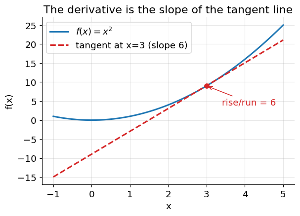

# Mathematical Foundations

A fast tour of the linear algebra, calculus, and probability you need before
Lecture 1. Every idea has a worked numeric example and, where useful, the
one-line NumPy equivalent. If you can follow every example here without getting
stuck, you are ready to begin.

This note is **pure math**. How it is used for learning algorithms is the
lecturer's job; the aim here is that the notation is already familiar.

---

## 1. Linear Algebra

### 1.1 Vectors

A vector is an ordered list of numbers; geometrically, an arrow from the origin to
a point. By convention we write vectors as **columns**:

$$
a = \begin{bmatrix} 1 \\ 2 \\ 3 \end{bmatrix}
$$

```python
import numpy as np
a = np.array([1, 2, 3])
```

The **length** (Euclidean norm):

$$
\|a\| = \sqrt{a_1^2 + \dots + a_n^2} = \sqrt{1^2 + 2^2 + 3^2} = \sqrt{14} \approx 3.742
$$

```python
np.linalg.norm(a)        # 3.7416...
```

### 1.2 Dot product

Multiply matching entries and sum:

$$
a \cdot b = \sum_{k=1}^{n} a_k b_k
$$

With $a = (1,2,3)$, $b = (4,5,6)$:

$$
a \cdot b = (1)(4) + (2)(5) + (3)(6) = 4 + 10 + 18 = 32
$$

```python
b = np.array([4, 5, 6])
a @ b            # 32
```

Geometric meaning: $a \cdot b = \|a\|\,\|b\|\cos\vartheta$, where $\vartheta$ is
the angle between the vectors. So the dot product is **positive** when they point
roughly the same way, **zero** when they are perpendicular, and **negative** when
they point apart. A vector dotted with itself gives its squared length:
$a \cdot a = \|a\|^2$.

### 1.3 Matrices

A matrix is a grid of numbers with $m$ rows and $n$ columns (an "$m \times n$"
matrix):

$$
A = \begin{bmatrix} 1 & 2 & 3 \\ 4 & 5 & 6 \end{bmatrix}
\qquad (2 \times 3)
$$

### 1.4 Matrix × vector

Each row of the matrix is dotted with the vector, giving one output number per
row:

$$
A x
= \begin{bmatrix} 1 & 2 \\ 1 & 3 \\ 1 & 5 \end{bmatrix}
\begin{bmatrix} 2 \\ 1 \end{bmatrix}
= \begin{bmatrix} (1)(2)+(2)(1) \\ (1)(2)+(3)(1) \\ (1)(2)+(5)(1) \end{bmatrix}
= \begin{bmatrix} 4 \\ 5 \\ 7 \end{bmatrix}
$$

```python
A = np.array([[1, 2], [1, 3], [1, 5]])
x = np.array([2, 1])
A @ x            # array([4, 5, 7])
```

An $m \times n$ matrix times an $n$-vector gives an $m$-vector. The **inner
dimensions must match** ($n = n$); the result takes the **outer** dimensions.

### 1.5 Matrix × matrix

Same rule for every (row of the left, column of the right) pair. If $A$ is
$p \times q$ and $B$ is $q \times r$, then $AB$ is $p \times r$:

$$
\begin{bmatrix} 1 & 2 \\ 3 & 4 \end{bmatrix}
\begin{bmatrix} 5 & 6 \\ 7 & 8 \end{bmatrix}
= \begin{bmatrix}
1\cdot5 + 2\cdot7 & 1\cdot6 + 2\cdot8 \\
3\cdot5 + 4\cdot7 & 3\cdot6 + 4\cdot8
\end{bmatrix}
= \begin{bmatrix} 19 & 22 \\ 43 & 50 \end{bmatrix}
$$

Order matters: in general $AB \neq BA$.

### 1.6 Transpose

Flip rows and columns. If $A$ is $m \times n$, then $A^\top$ is $n \times m$:

$$
A = \begin{bmatrix} 1 & 2 \\ 1 & 3 \end{bmatrix}
\qquad
A^\top = \begin{bmatrix} 1 & 1 \\ 2 & 3 \end{bmatrix}
$$

```python
A.T
```

Useful identities: $(A^\top)^\top = A$ and $(AB)^\top = B^\top A^\top$.

### 1.7 The product $A^\top A$

For any $m \times n$ matrix $A$, the product $A^\top A$ is **square** ($n \times
n$) and **symmetric**. Using the $A$ from 1.6:

$$
A^\top A
= \begin{bmatrix} 1 & 1 \\ 2 & 3 \end{bmatrix}
\begin{bmatrix} 1 & 2 \\ 1 & 3 \end{bmatrix}
= \begin{bmatrix} 2 & 5 \\ 5 & 13 \end{bmatrix}
$$

Entry $(i, j)$ of $A^\top A$ is the dot product of column $i$ and column $j$ of
$A$. Square symmetric matrices are the ones you can invert and diagonalize, which
is why this combination is everywhere.

### 1.8 Identity and inverse

The **identity** $I$ has 1s on the diagonal, 0s elsewhere, and acts like the
number 1: $IA = AI = A$.

$$
I_3 = \begin{bmatrix} 1 & 0 & 0 \\ 0 & 1 & 0 \\ 0 & 0 & 1 \end{bmatrix}
$$

The **inverse** $A^{-1}$ undoes $A$: $A^{-1}A = I$. Only square matrices can have
one, and only when the rows are linearly independent (nonzero determinant). For a
$2 \times 2$:

$$
\begin{bmatrix} a & b \\ c & d \end{bmatrix}^{-1}
= \frac{1}{ad - bc}
\begin{bmatrix} d & -b \\ -c & a \end{bmatrix}
$$

```python
np.eye(3)                 # identity
np.linalg.inv(A)          # inverse (errors if singular)
np.linalg.pinv(A)         # pseudo-inverse (works even when inv does not)
```

### 1.9 Broadcasting (a NumPy convenience)

NumPy automatically stretches a vector across every row of a matrix:

```python
M - M.mean(axis=0)        # subtract the column means from every row
```

This is not textbook notation, but it is how per-column arithmetic is written in
code.

---

## 2. Calculus

### 2.1 The derivative is a slope

The derivative $f'(x)$ is the slope of $f$ at $x$: the rate of change of output
per unit change of input. Positive means increasing, negative means decreasing,
zero means momentarily flat (a peak, a valley, or a saddle).



**Power rule:** if $f(x) = x^n$, then $f'(x) = n\,x^{n-1}$.

$$
f(x) = x^2 \;\Rightarrow\; f'(x) = 2x \;\Rightarrow\; f'(3) = 6
$$

At $x = 3$ the curve rises 6 units of output per unit of input — the slope of the
dashed tangent line.

### 2.2 Rules you will reuse constantly

| $f(x)$ | $f'(x)$ |
|---|---|
| $c$ (constant) | $0$ |
| $x^n$ | $n x^{n-1}$ |
| $e^x$ | $e^x$ |
| $\ln x$ | $1/x$ |
| $c \cdot g(x)$ | $c \cdot g'(x)$ |
| $g(x) + h(x)$ | $g'(x) + h'(x)$ |

$e^x$ and $\ln x$ are inverse functions: $\ln(e^x) = x$ and $e^{\ln x} = x$.
$e^x$ is always positive, grows faster than any polynomial, and equals its own
slope everywhere.

### 2.3 The chain rule

For a composite function $f(x) = h(g(x))$ — one function nested inside another —

$$
f'(x) = h'\big(g(x)\big) \cdot g'(x)
$$

"Derivative of the outside (keeping the inside intact), times derivative of the
inside."

$$
f(x) = (3x + 1)^2, \quad g(x) = 3x+1, \quad h(u) = u^2
$$
$$
f'(x) = \underbrace{2(3x+1)}_{h'(g(x))} \cdot \underbrace{3}_{g'(x)} = 6(3x+1),
\qquad f'(1) = 24
$$

$$
f(x) = e^{2x} \;\Rightarrow\; f'(x) = e^{2x} \cdot 2 = 2e^{2x},
\qquad f'(0) = 2
$$

The Lecture 12 note extends this to a chain of three or more nested functions.

### 2.4 Partial derivatives (preview — full treatment in the Lecture 2 note)

When $f$ has several inputs, the **partial derivative** $\partial f / \partial x$
is the ordinary derivative with respect to $x$ while every other variable is held
fixed. Collecting all the partials into a vector gives the **gradient**
$\nabla f$.

$$
f(x, y) = x^2 + 3xy
\quad\Rightarrow\quad
\frac{\partial f}{\partial x} = 2x + 3y, \qquad
\frac{\partial f}{\partial y} = 3x
$$

---

## 3. Probability

### 3.1 Random variables and distributions

A random variable is a numeric outcome of a random process. It is **discrete** if
it takes countable values (a die roll) and **continuous** if it takes values on a
range (a measurement). A distribution assigns probability to those values, and:

- every probability is between 0 and 1;
- the probabilities of all outcomes sum to 1 (discrete) or integrate to 1
  (continuous).

$$
\text{fair die: } P(X = k) = \tfrac{1}{6}, \quad k \in \{1,\dots,6\}
$$

### 3.2 Expectation (the mean)

The probability-weighted average — the balance point of the distribution:

$$
E[X] = \sum_k k \, P(X = k)
$$
$$
E[X]_{\text{fair die}} = \frac{1+2+3+4+5+6}{6} = 3.5
$$

Linearity: $E[aX + b] = a\,E[X] + b$, always.

### 3.3 Variance and standard deviation (the spread)

$$
\operatorname{Var}(X) = E\big[(X - E[X])^2\big]
= E[X^2] - (E[X])^2,
\qquad
\operatorname{std}(X) = \sqrt{\operatorname{Var}(X)}
$$

Variance is the mean squared distance from the mean. For the fair die,
$\operatorname{Var}(X) = \tfrac{1}{6}\sum (k - 3.5)^2 \approx 2.92$.

```python
X.mean(axis=0)
X.std(axis=0)            # population std (ddof=0); pass ddof=1 for the sample std
```

### 3.4 Conditional probability

$P(A \mid B)$ is the probability of $A$ **given that $B$ occurred**. Conditioning
on $B$ restricts attention to the outcomes inside $B$:

$$
P(A \mid B) = \frac{P(A \cap B)}{P(B)}
$$

Rolling a fair die, $A = \{\text{even}\} = \{2,4,6\}$,
$B = \{>3\} = \{4,5,6\}$:

$$
A \cap B = \{4, 6\}, \qquad
P(A \mid B) = \frac{2/6}{3/6} = \frac{2}{3} \approx 0.667
$$

Drawing one card from 52, $A = \{\text{King}\}$, $B = \{\text{face card}\}$ (12
cards):

$$
P(A \mid B) = \frac{4/52}{12/52} = \frac{1}{3}
$$

### 3.5 Independence

$A$ and $B$ are independent when knowing one says nothing about the other:

$$
P(A \mid B) = P(A)
\qquad\Longleftrightarrow\qquad
P(A \cap B) = P(A)\,P(B)
$$

### 3.6 Bayes' rule (preview — full treatment in the Lecture 5 note)

$$
P(A \mid B) = \frac{P(B \mid A)\,P(A)}{P(B)}
$$

It reverses the direction of a conditional probability: it converts
$P(\text{evidence} \mid \text{cause})$ into
$P(\text{cause} \mid \text{evidence})$.

---

## Check yourself

1. $a = (2, -1, 2)$. Find $\|a\|$ and $a \cdot a$.
2. $A$ has rows $[1,\ 4]$ and $[1,\ 6]$, and $x = (1, 0.5)$. Compute $Ax$. What
   are the dimensions of $A^\top A$?
3. $f(x) = 5x^3$. Find $f'(x)$ and $f'(2)$.
4. $f(x) = \ln(x^2 + 1)$. Use the chain rule to find $f'(x)$.
5. A bag holds 3 red and 2 blue balls; you draw two without replacement.
   Find $P(\text{2nd red} \mid \text{1st red})$.
6. $X$ is 0 with probability $0.75$ and 4 with probability $0.25$. Find $E[X]$ and
   $\operatorname{Var}(X)$.

<details>
<summary>Answers</summary>

1. $\|a\| = \sqrt{4+1+4} = 3$; $a \cdot a = 9 = \|a\|^2$.
2. $Ax = (1\cdot1 + 4\cdot0.5,\; 1\cdot1 + 6\cdot0.5) = (3, 4)$; $A^\top A$ is
   $2 \times 2$.
3. $f'(x) = 15x^2$; $f'(2) = 60$.
4. $f'(x) = \dfrac{2x}{x^2+1}$.
5. Two red and two blue remain, so $P = 2/4 = 0.5$.
6. $E[X] = 1$;
   $\operatorname{Var}(X) = (0-1)^2(0.75) + (4-1)^2(0.25) = 0.75 + 2.25 = 3$.

</details>

---

Later topics — Bayes' theorem in depth, the Gaussian distribution, entropy,
Jensen's inequality, Markov chains — appear in the note placed just before the
lecture that needs them.
