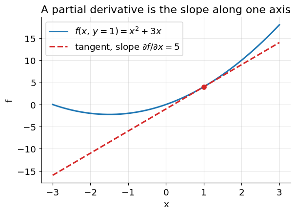
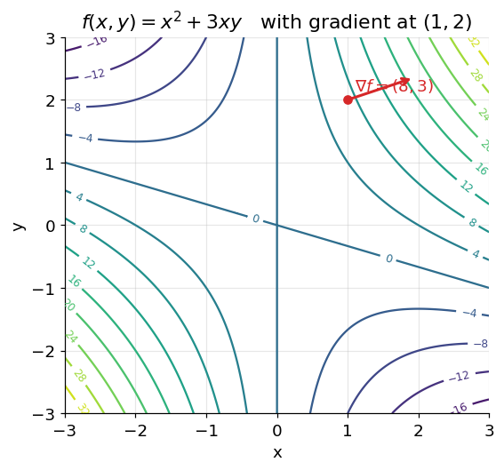

# Partial Derivatives and the Gradient

**Before Lecture 2.** This note covers the multivariable-calculus fact the lecture
leans on: how to differentiate a function of several variables, and what the
resulting **gradient vector** means geometrically.

Prerequisite: the single-variable derivative (see
[00_before_course_begins.md](00_before_course_begins.md), §2).

---

## 1. Partial derivatives

The derivative of a one-input function is its slope. A function of several inputs
has a slope in *every* direction, so we start with the simplest ones: the slopes
along each axis.

The **partial derivative** $\dfrac{\partial f}{\partial x}$ is the ordinary
derivative with respect to $x$, treating **every other variable as a constant**.

### Worked example

$$
f(x, y) = x^2 + 3xy
$$

Differentiate with respect to $x$ (hold $y$ fixed, so $3xy$ behaves like
$3(\text{const})\,x$):

$$
\frac{\partial f}{\partial x} = 2x + 3y
$$

Differentiate with respect to $y$ (hold $x$ fixed, so $x^2$ is a constant and
drops out):

$$
\frac{\partial f}{\partial y} = 3x
$$

Evaluate at $(x, y) = (1, 2)$:

$$
\frac{\partial f}{\partial x}\bigg|_{(1,2)} = 2(1) + 3(2) = 8,
\qquad
\frac{\partial f}{\partial y}\bigg|_{(1,2)} = 3(1) = 3
$$

Geometrically, $\partial f/\partial x$ is the slope of the 1-D curve you get by
slicing the surface with the plane $y = \text{const}$:

### More examples

| $f$ | $\partial f/\partial x$ | $\partial f/\partial y$ |
|---|---|---|
| $x^2 y$ | $2xy$ | $x^2$ |
| $x/y$ | $1/y$ | $-x/y^2$ |
| $e^{xy}$ | $y\,e^{xy}$ | $x\,e^{xy}$ |
| $\ln(x^2 + y^2)$ | $\dfrac{2x}{x^2+y^2}$ | $\dfrac{2y}{x^2+y^2}$ |

The chain rule still applies inside a partial derivative — the last two rows use
it.

---

## 2. The gradient

The **gradient** collects all first partial derivatives into one vector:

$$
\nabla f(x, y) =
\begin{bmatrix}
\partial f / \partial x \\[2pt]
\partial f / \partial y
\end{bmatrix},
\qquad
\nabla f(1, 2) = \begin{bmatrix} 8 \\ 3 \end{bmatrix}
$$

For a function of $n$ variables the gradient is an $n$-vector. It is a *function*
of position: it generally has a different value at every point.

### What the gradient means

- **Direction:** $\nabla f$ points in the direction of **steepest increase** of
  $f$. The opposite direction, $-\nabla f$, is steepest decrease.
- **Magnitude:** $\|\nabla f\|$ is how steep that steepest slope is.
- **Level sets:** $\nabla f$ is always **perpendicular** to the contour (level
  set) passing through the point.

The curves join points of equal $f$. At $(1, 2)$ the gradient $(8, 3)$ points
"uphill", straight across the contours, toward larger values.

---

## 3. The directional derivative

The partials are slopes along the axes. The slope in an **arbitrary** unit
direction $u$ (with $\|u\| = 1$) is the dot product of the gradient with $u$:

$$
D_u f = \nabla f \cdot u
$$

Example, at the point where $\nabla f = (8, 3)$, moving along
$u = \left(\tfrac{3}{5}, \tfrac{4}{5}\right)$:

$$
D_u f = (8)\tfrac{3}{5} + (3)\tfrac{4}{5} = \tfrac{24 + 12}{5} = 7.2
$$

Because $D_u f = \|\nabla f\|\cos\vartheta$, it is largest when $u$ points **along**
the gradient ($\vartheta = 0$) and zero when $u$ is **along a contour**
($\vartheta = 90^\circ$). That is the precise statement of "the gradient is the
steepest-ascent direction".

---

## 4. Critical points

A **critical point** is where the gradient is the zero vector:

$$
\nabla f = \mathbf{0}
$$

At such a point the surface is momentarily flat in every direction — it is a
candidate for a maximum, a minimum, or a saddle. For
$f(x,y) = x^2 + y^2$, setting $\nabla f = (2x, 2y) = (0,0)$ gives the single
critical point $(0, 0)$, which is the minimum.

Finding where $\nabla f = \mathbf 0$ is the multivariable version of "set the
derivative to zero", and it is how closed-form minima and maxima are located.

---

## Check yourself

1. $f(x, y) = 4x^2 y + y^3$. Find $\partial f/\partial x$ and
   $\partial f/\partial y$.
2. Evaluate $\nabla f$ at $(1, 2)$ for the function in question 1.
3. $f(x, y) = 3x + 4y$. What is $\nabla f$? Does it depend on the point?
4. At a point where $\nabla f = (1, 2)$, what is the slope of $f$ in the direction
   $u = (0, 1)$? In the direction $u = \left(\tfrac{1}{\sqrt5}, \tfrac{2}{\sqrt5}\right)$?
5. Find all critical points of $f(x, y) = x^2 - 4x + y^2 + 2y$.

Answers

1. $\partial f/\partial x = 8xy$; $\partial f/\partial y = 4x^2 + 3y^2$.
2. $\nabla f(1,2) = (8 \cdot 1 \cdot 2,\; 4 \cdot 1 + 3 \cdot 4) = (16, 16)$.
3. $\nabla f = (3, 4)$ everywhere — for a linear function the gradient is
   constant.
4. Along $(0,1)$: $D_u f = (1)(0) + (2)(1) = 2$.
   Along $\left(\tfrac{1}{\sqrt5}, \tfrac{2}{\sqrt5}\right)$:
   $D_u f = \tfrac{1}{\sqrt5} + \tfrac{4}{\sqrt5} = \tfrac{5}{\sqrt5} = \sqrt5 \approx 2.236$
   (this direction *is* the gradient direction, so it gives the steepest slope,
   $\|\nabla f\| = \sqrt5$).
5. $\nabla f = (2x - 4,\; 2y + 2) = (0, 0) \Rightarrow (x, y) = (2, -1)$.

