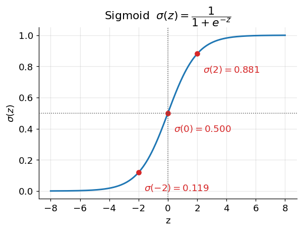
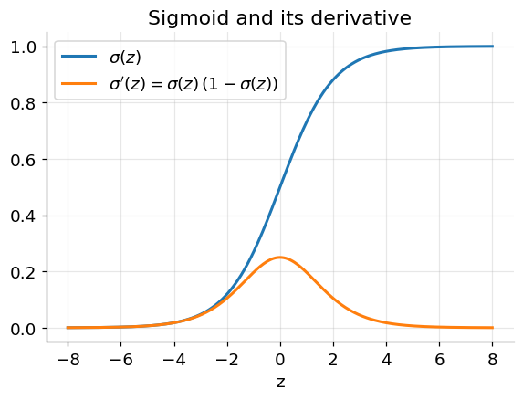

# The Logistic (Sigmoid) Function

**Before Lecture 3.** Lecture 3 uses one specific function repeatedly. This note
is just about that function: its formula, its shape, and its derivative.

Prerequisite: $e^x$ and the chain rule
([00_before_course_begins.md](00_before_course_begins.md), §2).

---

## 1. Definition

$$
\sigma(z) = \frac{1}{1 + e^{-z}}
$$

It takes **any** real number and returns a value strictly **between 0 and 1**.

| $z$ | $e^{-z}$ | $\sigma(z) = 1/(1 + e^{-z})$ |
|---|---|---|
| $-4$ | $54.60$ | $0.018$ |
| $-2$ | $7.389$ | $0.119$ |
| $-1$ | $2.718$ | $0.269$ |
| $0$ | $1$ | $0.500$ |
| $1$ | $0.368$ | $0.731$ |
| $2$ | $0.135$ | $0.881$ |
| $4$ | $0.018$ | $0.982$ |



```python
import numpy as np
def sigmoid(z):
    return 1.0 / (1.0 + np.exp(-z))
```

---

## 2. Properties

- **Range:** $0 < \sigma(z) < 1$ for all $z$; it never actually reaches 0 or 1.
- **Limits:** $\sigma(z) \to 1$ as $z \to +\infty$, and $\sigma(z) \to 0$ as
  $z \to -\infty$.
- **Midpoint:** $\sigma(0) = \tfrac12$.
- **Rotational symmetry about $(0, \tfrac12)$:**
  $$
  \sigma(-z) = 1 - \sigma(z)
  $$
  Check with the table: $\sigma(-2) = 0.119$ and $1 - \sigma(2) = 1 - 0.881 = 0.119$.
- **Monotonic:** strictly increasing everywhere, so it is one-to-one and
  invertible. Its inverse is the *logit*,
  $\sigma^{-1}(p) = \ln\!\dfrac{p}{1-p}$.
- **Shape:** a smooth "S" (sigmoid = S-shaped). It is nearly linear near $z = 0$
  and **saturates** (flattens) for large $|z|$, so far from the origin a big
  change in $z$ barely moves the output.

---

## 3. Its derivative

The sigmoid has an unusually tidy derivative that you should just memorize:

$$
\sigma'(z) = \sigma(z)\,\big(1 - \sigma(z)\big)
$$

### Derivation (chain rule + quotient)

Write $\sigma(z) = (1 + e^{-z})^{-1}$. With the chain rule,

$$
\sigma'(z) = -\,(1 + e^{-z})^{-2} \cdot \frac{d}{dz}(1 + e^{-z})
= -\,(1 + e^{-z})^{-2} \cdot (-e^{-z})
= \frac{e^{-z}}{(1 + e^{-z})^2}
$$

Now split it:

$$
\frac{e^{-z}}{(1 + e^{-z})^2}
= \underbrace{\frac{1}{1 + e^{-z}}}_{\sigma(z)} \cdot
  \underbrace{\frac{e^{-z}}{1 + e^{-z}}}_{1 - \sigma(z)}
= \sigma(z)\big(1 - \sigma(z)\big)
$$



### Consequences

- The derivative is **largest at $z = 0$**, where it equals
  $\tfrac12 \cdot \tfrac12 = 0.25$.
- It **goes to 0** as $|z| \to \infty$ — the flat tails have almost no slope.
- It is always positive (consistent with $\sigma$ being increasing) and symmetric:
  $\sigma'(-z) = \sigma'(z)$.

Numeric check at $z = 2$: $\sigma(2) = 0.881$, so
$\sigma'(2) = 0.881 \times 0.119 \approx 0.105$.

---

## Check yourself

1. Compute $\sigma(-1)$ and $\sigma(3)$ to three decimals.
2. Use $\sigma(-z) = 1 - \sigma(z)$ to get $\sigma(-3)$ from your answer to
   question 1.
3. What is $\sigma'(0)$? Why is it the maximum of $\sigma'$?
4. As $z \to \infty$, what do $\sigma(z)$ and $\sigma'(z)$ each approach?
5. Solve $\sigma(z) = 0.9$ for $z$ using the logit formula.

<details>
<summary>Answers</summary>

1. $\sigma(-1) = 1/(1 + e^{1}) = 1/3.718 = 0.269$;
   $\sigma(3) = 1/(1 + e^{-3}) = 1/1.0498 = 0.953$.
2. $\sigma(-3) = 1 - 0.953 = 0.047$.
3. $\sigma'(0) = \sigma(0)(1 - \sigma(0)) = 0.5 \times 0.5 = 0.25$. The product
   $p(1-p)$ is maximized at $p = 0.5$, which occurs at $z = 0$.
4. $\sigma(z) \to 1$ and $\sigma'(z) \to 0$.
5. $z = \ln\frac{0.9}{0.1} = \ln 9 \approx 2.197$.

</details>
