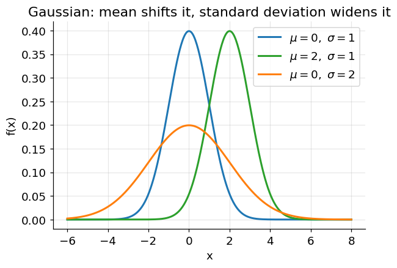

# Bayes' Rule and the Gaussian Distribution

**Before Lecture 5.** Two pieces of probability the lecture assumes: how to invert
a conditional probability (Bayes' rule) and the formula and shape of the normal
distribution.

Prerequisite: conditional probability and expectation
([00_before_course_begins.md](00_before_course_begins.md), §3).

---

## 1. Bayes' rule

### The formula

Starting from the definition of conditional probability,
$P(A \cap B) = P(A \mid B)\,P(B) = P(B \mid A)\,P(A)$, divide by $P(B)$:

$$
P(A \mid B) = \frac{P(B \mid A)\,P(A)}{P(B)}
$$

Names for the pieces:

| Term | Name | Meaning |
|---|---|---|
| $P(A \mid B)$ | posterior | what you want: the cause given the evidence |
| $P(B \mid A)$ | likelihood | how well the cause explains the evidence |
| $P(A)$ | prior | belief in the cause before seeing evidence |
| $P(B)$ | evidence | total probability of the observation |

The denominator is usually computed with the **law of total probability**, by
splitting the evidence across the cases of $A$:

$$
P(B) = P(B \mid A)\,P(A) + P(B \mid \lnot A)\,P(\lnot A)
$$

### Worked example — a medical test

$$
\begin{aligned}
P(D) &= 0.01 &&\text{(1\% of people have the disease)}\\
P(+ \mid D) &= 0.99 &&\text{(true positive rate)}\\
P(+ \mid \lnot D) &= 0.05 &&\text{(false positive rate)}
\end{aligned}
$$

Evidence:

$$
P(+) = (0.99)(0.01) + (0.05)(0.99) = 0.0099 + 0.0495 = 0.0594
$$

Posterior:

$$
P(D \mid +) = \frac{P(+ \mid D)\,P(D)}{P(+)}
= \frac{0.0099}{0.0594} = 0.167
$$

A positive result on a 99%-accurate test still means only a **16.7%** chance of
actually having the disease — because the disease is rare, most positives are
false positives drawn from the huge healthy majority. This "base-rate" effect is
the whole reason Bayes' rule is worth stating explicitly.

### A frequency picture (same numbers)

Imagine 10,000 people. 1% (100) have the disease; 9,900 do not.

| | has disease (100) | healthy (9,900) | total |
|---|---|---|---|
| **test positive** | 99 | 495 | 594 |
| **test negative** | 1 | 9,405 | 9,406 |

Of the 594 positive tests, only 99 are real:

$$
P(D \mid +) = \frac{99}{99 + 495} = \frac{99}{594} = 0.167
$$

Identical result, no formula needed — this is often the fastest way to sanity-check
a Bayes calculation.

---

## 2. The Gaussian (normal) distribution

### The formula

A Gaussian with mean $\mu$ and standard deviation $\sigma$ has the probability
density

$$
f(x) = \frac{1}{\sigma\sqrt{2\pi}}\;
\exp\!\left(-\frac{(x - \mu)^2}{2\sigma^2}\right)
$$

- $\mu$ sets the **center** (also the peak, since the curve is symmetric).
- $\sigma$ sets the **width**; $\sigma^2$ is the variance.
- The $\dfrac{1}{\sigma\sqrt{2\pi}}$ factor makes the total area equal to 1.

### Standard normal ($\mu = 0$, $\sigma = 1$)

$$
f(x) = \frac{1}{\sqrt{2\pi}}\,e^{-x^2/2}
$$

| $x$ | $f(x)$ |
|---|---|
| $0$ | $0.399$ |
| $\pm 1$ | $0.242$ |
| $\pm 2$ | $0.054$ |
| $\pm 3$ | $0.004$ |

### Shape

Changing $\mu$ slides the bell left/right; increasing $\sigma$ makes it shorter
and wider (the area stays 1). The **68–95–99.7 rule**: about 68% of the mass lies
within $1\sigma$ of the mean, 95% within $2\sigma$, and 99.7% within $3\sigma$.

### A note on relative likelihood

For a continuous distribution, $f(x)$ is a **density**, not a probability — it can
even exceed 1 for a narrow Gaussian. What is meaningful is a **ratio**: comparing
$f(x)$ under two different Gaussians tells you which one makes the observed $x$
more plausible. For $x = 1.5$ with $\mu_1 = 1, \mu_2 = 4$ and $\sigma = 1.2$:

$$
\frac{f_1(1.5)}{f_2(1.5)}
= \frac{\exp\!\big(-(1.5-1)^2 / (2 \cdot 1.44)\big)}
       {\exp\!\big(-(1.5-4)^2 / (2 \cdot 1.44)\big)}
= \frac{\exp(-0.087)}{\exp(-2.17)}
= \frac{0.917}{0.114} \approx 8.0
$$

so $x = 1.5$ is about 8× more consistent with the first Gaussian than the second.

---

## Check yourself

1. A spam filter: 30% of mail is spam. The word "prize" appears in 60% of spam and
   2% of non-spam. An email contains "prize". What is $P(\text{spam} \mid
   \text{"prize"})$?
2. For the standard normal, which is larger: $f(0.5)$ or $f(-0.5)$? Why?
3. A Gaussian has $\mu = 10$, $\sigma = 2$. Between which two values does roughly
   95% of the probability lie?
4. If you double $\sigma$, what happens to the height of the peak
   $f(\mu) = \dfrac{1}{\sigma\sqrt{2\pi}}$?
5. Two Gaussians share $\sigma = 1$ but have $\mu = 0$ and $\mu = 2$. For which
   $x$ are they equally likely?

Answers

1. $P(+) = (0.6)(0.3) + (0.02)(0.7) = 0.18 + 0.014 = 0.194$;
   $P(\text{spam} \mid +) = 0.18 / 0.194 = 0.928$.
2. Equal — the standard normal is symmetric about 0, so $f(0.5) = f(-0.5)$.
3. $\mu \pm 2\sigma = 10 \pm 4$, i.e. between 6 and 14.
4. It is halved (the factor $1/\sigma$).
5. At $x = 1$, the midpoint — equal distance from both means gives equal density.

