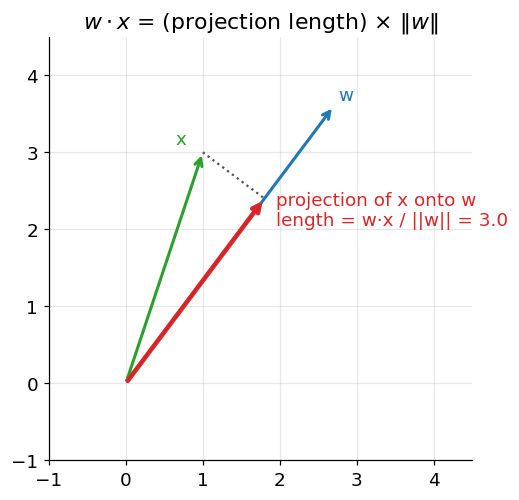
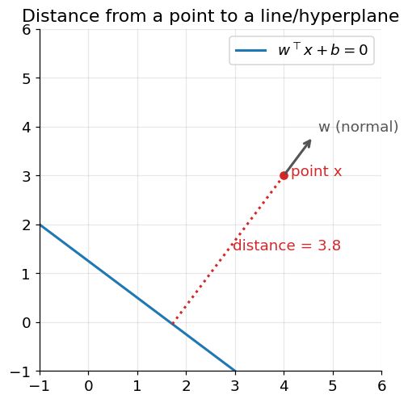

# Dot Products, Projections, and Hyperplanes

**Before Lecture 6.** The geometry the lecture draws on: reading a dot product as a
projection, and measuring the distance from a point to a hyperplane.

Prerequisite: dot product and vector norm
([00_before_course_begins.md](00_before_course_begins.md), §1).

---

## 1. The dot product as a projection

Recall

$$
w \cdot x = \|w\|\,\|x\|\cos\vartheta
$$

where $\vartheta$ is the angle between $w$ and $x$. Rearranging,

$$
\frac{w \cdot x}{\|w\|} = \|x\|\cos\vartheta
$$

and $\|x\|\cos\vartheta$ is exactly the length of the **shadow of $x$ on the line
through $w$** — the scalar projection of $x$ onto $w$'s direction.

### Worked example

$$
w = (3, 4), \qquad x = (1, 1)
$$
$$
w \cdot x = (3)(1) + (4)(1) = 7, \qquad \|w\| = \sqrt{3^2 + 4^2} = 5
$$
$$
\text{projection length} = \frac{w \cdot x}{\|w\|} = \frac{7}{5} = 1.4
$$

If $\hat w = w / \|w\|$ is the unit vector along $w$, the projected **vector** is
$(x \cdot \hat w)\,\hat w = 1.4 \,\hat w = (0.84, 1.12)$.

Special cases:
- $w \cdot x = 0$ &nbsp;⟺&nbsp; $x \perp w$ (zero shadow).
- $w \cdot x = \|w\|\|x\|$ &nbsp;⟺&nbsp; $x$ and $w$ point the same way.

---

## 2. Hyperplanes

A **hyperplane** is the set of points $x$ satisfying

$$
w^\top x + b = 0
$$

for a fixed normal vector $w$ and offset $b$. In 2-D this is a line; in 3-D a
plane; in $n$-D an $(n-1)$-dimensional flat.

- $w$ is **perpendicular** to the hyperplane (it is the *normal*).
- The sign of $w^\top x + b$ tells you which side of the hyperplane $x$ is on:
  positive on one side, negative on the other, zero exactly on it.

---

## 3. Distance from a point to a hyperplane

The perpendicular distance from a point $x_0$ to the hyperplane
$w^\top x + b = 0$ is

$$
\text{distance} = \frac{\lvert w^\top x_0 + b \rvert}{\|w\|}
$$

The quantity $w^\top x_0 + b$ without the absolute value is the **signed**
distance times $\|w\|$ — useful when you care which side you are on.

### Why the formula is what it is

$w^\top x_0 + b$ measures how far $x_0$ is from the hyperplane, but scaled by
$\|w\|$: if you doubled $w$ and $b$, the hyperplane would be unchanged yet
$w^\top x_0 + b$ would double. Dividing by $\|w\|$ removes that arbitrary scaling
and leaves a true geometric distance.

### Worked example

Hyperplane $3x_1 + 4x_2 - 5 = 0$, so $w = (3, 4)$, $b = -5$. Point
$x_0 = (4, 3)$:

$$
w^\top x_0 + b = (3)(4) + (4)(3) - 5 = 12 + 12 - 5 = 19
$$
$$
\|w\| = 5
\qquad\Longrightarrow\qquad
\text{distance} = \frac{19}{5} = 3.8
$$

The result is positive, so $x_0$ is on the positive side of the hyperplane.

---

## Check yourself

1. $w = (1, 2, 2)$, $x = (3, 0, 4)$. Find $w \cdot x$, $\|w\|$, and the length of
   the projection of $x$ onto $w$.
2. Are $(2, -1)$ and $(1, 2)$ perpendicular? How can you tell instantly?
3. For the line $x_1 - x_2 + 2 = 0$, which side is the origin $(0,0)$ on —
   positive or negative?
4. Distance from $(3, 3)$ to the line $x_1 + x_2 - 2 = 0$.
5. If you scale $(w, b)$ by 10, the hyperplane $w^\top x + b = 0$ is unchanged.
   What happens to $w^\top x_0 + b$ for a fixed point $x_0$, and why does dividing
   by $\|w\|$ fix it?

Answers

1. $w \cdot x = 3 + 0 + 8 = 11$; $\|w\| = \sqrt{1 + 4 + 4} = 3$;
   projection length $= 11/3 \approx 3.67$.
2. Dot product $= (2)(1) + (-1)(2) = 0$, so yes — a zero dot product means
   perpendicular.
3. $0 - 0 + 2 = 2 > 0$: the positive side.
4. $|3 + 3 - 2| / \sqrt{1^2 + 1^2} = 4/\sqrt2 = 2\sqrt2 \approx 2.83$.
5. It scales by 10 as well; dividing by $\|w\|$ (which also scaled by 10) cancels
   the factor, leaving the same geometric distance.

