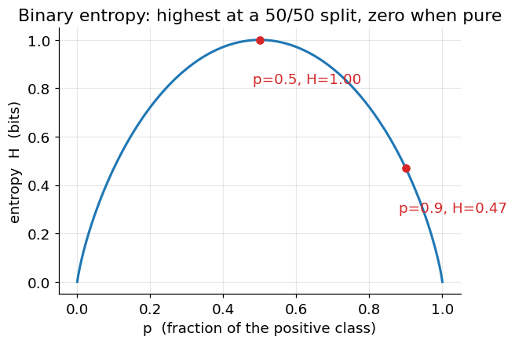

# Logarithms, Entropy, and Information

**Before Lecture 10.** The lecture measures how "mixed" a set of labels is using
**entropy**. This note covers the logarithm facts it needs and the entropy
formula itself.

Prerequisite: probability of a discrete outcome
([00_before_course_begins.md](00_before_course_begins.md), §3).

---

## 1. Logarithm refresher

$\log_b x$ answers "$b$ to what power gives $x$?" Entropy uses base 2, so the unit
is the **bit**.

| $x$ | $\log_2 x$ |
|---|---|
| $1$ | $0$ |
| $2$ | $1$ |
| $4$ | $2$ |
| $1/2$ | $-1$ |
| $1/8$ | $-3$ |
| $0.9$ | $-0.152$ |
| $0.1$ | $-3.322$ |

Facts used below:

- $\log(1) = 0$, and $\log x < 0$ for $0 < x < 1$.
- $\log(xy) = \log x + \log y$, &nbsp; $\log(x/y) = \log x - \log y$.
- Change of base: $\log_2 x = \dfrac{\ln x}{\ln 2}$ (so $\ln 2 \approx 0.693$).
- $-\log_2 p$ grows without bound as $p \to 0$: rare events carry a large
  "surprise".

---

## 2. Entropy

For a discrete distribution with probabilities $p_1, \dots, p_k$, the entropy is

$$
H = -\sum_{i=1}^{k} p_i \log_2 p_i
$$

(By convention $0 \log_2 0 = 0$.) Read it as the **average surprise**: each
outcome contributes its surprise $-\log_2 p_i$, weighted by how often it happens,
$p_i$.

- $H = 0$ &nbsp;⟺&nbsp; one outcome has probability 1 (no uncertainty).
- $H$ is **maximal** when all $k$ outcomes are equally likely, where
  $H = \log_2 k$.

### The two-outcome case

With probabilities $p$ and $1 - p$:

$$
H(p) = -p\log_2 p - (1 - p)\log_2(1 - p)
$$

**Example 1 — a 50/50 split** ($p = 0.5$):

$$
H = -\big[\,0.5\log_2 0.5 + 0.5\log_2 0.5\,\big]
  = -\big[\,0.5(-1) + 0.5(-1)\,\big] = 1 \text{ bit}
$$

Maximum uncertainty: one clean yes/no question's worth.

**Example 2 — a 9:1 split** ($p = 0.9$):

$$
H = -\big[\,0.9\log_2 0.9 + 0.1\log_2 0.1\,\big]
  = -\big[\,0.9(-0.152) + 0.1(-3.322)\,\big]
  = -[-0.137 - 0.332] = 0.469 \text{ bits}
$$

Much lower — the set is nearly pure, so there is little uncertainty left.

**Example 3 — four equally likely outcomes** ($p_i = 0.25$):

$$
H = -4 \times \big(0.25 \log_2 0.25\big) = -4 \times 0.25 \times (-2) = 2 \text{ bits}
= \log_2 4
$$

---

## 3. Information gain

If you partition a set $S$ into subsets $S_1, \dots, S_r$, the **information gain**
is the drop in entropy, averaging the pieces by size:

$$
\text{IG} = H(S) \;-\; \sum_{j=1}^{r} \frac{|S_j|}{|S|}\, H(S_j)
$$

### Worked example

$S$ has 10 items, 5 positive and 5 negative, so $H(S) = 1$ bit. A split produces:

- $S_1$: 4 items, all positive → $H(S_1) = 0$
- $S_2$: 6 items, 1 positive and 5 negative → $p = 1/6$,
  $H(S_2) = -\tfrac16\log_2\tfrac16 - \tfrac56\log_2\tfrac56 = 0.430 + 0.219 = 0.650$

$$
\text{IG} = 1 - \left(\frac{4}{10}(0) + \frac{6}{10}(0.650)\right)
         = 1 - 0.390 = 0.610 \text{ bits}
$$

A split into purer groups removes more entropy and therefore has higher
information gain — that number is what a decision tree compares across candidate
splits.

---

## Check yourself

1. Compute $\log_2 32$ and $\log_2(1/16)$.
2. A set is 100% one class. What is its entropy, and why?
3. Entropy of a set that is 2/3 class A and 1/3 class B.
4. A fair eight-sided die: what is the entropy of one roll, in bits?
5. $H(S) = 0.94$. A split gives two halves (equal size) with entropies $0.72$ and
   $0.0$. What is the information gain?

Answers

1. $\log_2 32 = 5$; $\log_2(1/16) = -4$.
2. $0$ — the only nonzero term is $1 \cdot \log_2 1 = 0$; no uncertainty.
3. $H = -\tfrac23\log_2\tfrac23 - \tfrac13\log_2\tfrac13
   = \tfrac23(0.585) + \tfrac13(1.585) = 0.390 + 0.528 = 0.918$ bits.
4. $\log_2 8 = 3$ bits (eight equally likely outcomes).
5. $\text{IG} = 0.94 - (0.5 \cdot 0.72 + 0.5 \cdot 0.0) = 0.94 - 0.36 = 0.58$
   bits.

