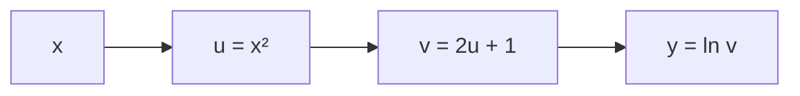
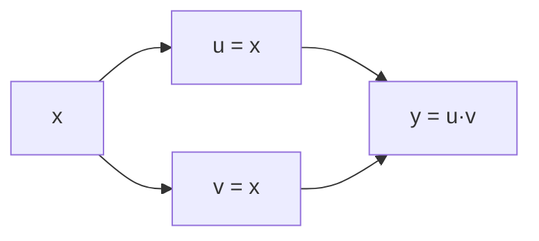

# The Chain Rule Through a Chain of Functions

**Before Lecture 12.** The lecture differentiates functions that are many layers
deep. The only calculus tool needed is the chain rule — applied repeatedly. This
note practises exactly that.

Prerequisite: the two-function chain rule
([00_before_course_begins.md](00_before_course_begins.md), §2.3).

---

## 1. Two functions (recap)

If $y = f(g(x))$, then

$$
\frac{dy}{dx} = \frac{dy}{du}\cdot\frac{du}{dx}
\qquad\text{where } u = g(x)
$$

The derivatives **multiply** along the chain.

---

## 2. Three or more functions

Nesting three functions, $y = f(g(h(x)))$, just makes the product longer:

$$
\frac{dy}{dx}
= \frac{dy}{dv}\cdot\frac{dv}{du}\cdot\frac{du}{dx}
\qquad u = h(x),\quad v = g(u)
$$

### Worked example

$$
h(x) = x^2, \qquad g(u) = 2u + 1, \qquad f(v) = \ln v
$$

so the composite function is $y = \ln(2x^2 + 1)$.

**Forward pass** — compute each intermediate value at $x = 2$:

$$
u = 2^2 = 4, \qquad v = 2(4) + 1 = 9, \qquad y = \ln 9 \approx 2.197
$$

**Local derivatives** — one per link:

$$
\frac{du}{dx} = 2x = 4, \qquad
\frac{dv}{du} = 2, \qquad
\frac{dy}{dv} = \frac{1}{v} = \frac{1}{9}
$$

**Multiply along the chain:**

$$
\frac{dy}{dx} = \frac{dy}{dv}\cdot\frac{dv}{du}\cdot\frac{du}{dx}
= \frac{1}{9}\cdot 2 \cdot 4 = \frac{8}{9} \approx 0.889
$$

**Check directly:** $y = \ln(2x^2 + 1)$, so
$\dfrac{dy}{dx} = \dfrac{4x}{2x^2 + 1} = \dfrac{8}{9}$. ✓

---

## 3. Computing it backwards

Notice you can build $\dfrac{dy}{dx}$ from the output end inwards, carrying one
running number:

| step | quantity | value |
|---|---|---|
| start at the output | $\dfrac{dy}{dy}$ | $1$ |
| multiply by $\dfrac{dy}{dv} = 1/v$ | $\dfrac{dy}{dv}$ | $0.111$ |
| multiply by $\dfrac{dv}{du} = 2$ | $\dfrac{dy}{du}$ | $0.222$ |
| multiply by $\dfrac{du}{dx} = 2x$ | $\dfrac{dy}{dx}$ | $0.889$ |

Each step reuses an intermediate value ($v$, then $x$) that was recorded during
the forward pass. Sweeping local derivatives from output back to input like this
is *why* the values are stored on the way forward — it is more efficient than
recomputing the whole product for every input variable separately.

---

## 4. When a variable feeds more than one path

If $x$ is used in two places that later recombine, the chain rule says **add the
contribution from each path**. For $y = u\,v$ with $u = x$ and $v = x$ (i.e.
$y = x^2$):

$$
\frac{dy}{dx}
= \underbrace{\frac{\partial y}{\partial u}\frac{du}{dx}}_{\text{path through }u}
\;+\; \underbrace{\frac{\partial y}{\partial v}\frac{dv}{dx}}_{\text{path through }v}
= v\cdot 1 + u\cdot 1 = x + x = 2x
$$

Rule of thumb: **multiply along a path, add across paths.**

---

## 5. A four-link chain

$$
y = \big(\sin(x^2)\big)^3
$$

Layers: $u = x^2$, &nbsp; $v = \sin u$, &nbsp; $w = v^3$, &nbsp; $y = w$.

$$
\frac{dy}{dx}
= \underbrace{3v^2}_{dw/dv}\cdot
  \underbrace{\cos u}_{dv/du}\cdot
  \underbrace{2x}_{du/dx}
= 3\sin^2(x^2)\,\cos(x^2)\,(2x)
$$

At $x = 1$: $u = 1$, $v = \sin 1 = 0.841$, so
$\dfrac{dy}{dx} = 3(0.841)^2(\cos 1)(2) = 3(0.708)(0.540)(2) \approx 2.29$.

---

## Check yourself

1. $y = e^{3x + 1}$. Find $dy/dx$ using $u = 3x + 1$.
2. $y = \sqrt{x^2 + 1}$. Find $dy/dx$, then evaluate at $x = 2$.
3. For $y = \ln(2x^2 + 1)$ (the §2 example), redo the backward table at $x = 1$.
4. $y = (x^3 - x)^4$. Find $dy/dx$.
5. $y = x \cdot e^x$ can be seen as two paths from $x$ recombining at a product.
   Use "multiply along paths, add across paths" to get $dy/dx$.

Answers

1. $dy/dx = e^{3x+1}\cdot 3 = 3e^{3x+1}$.
2. $u = x^2 + 1$, $y = u^{1/2}$; $dy/dx = \tfrac12 u^{-1/2}\cdot 2x = \dfrac{x}{\sqrt{x^2+1}}$.
   At $x = 2$: $2/\sqrt5 \approx 0.894$.
3. At $x = 1$: $u = 1$, $v = 3$. Start $1$ → $\times\, \tfrac{1}{v} = 0.333$ →
   $\times\, 2 = 0.667$ → $\times\, 2x = 1.333$.
   Check: $4x/(2x^2 + 1) = 4/3 = 1.333$. ✓
4. $dy/dx = 4(x^3 - x)^3\,(3x^2 - 1)$.
5. Path through the first $x$: $e^x \cdot 1$. Path through $e^x$:
   $x \cdot e^x$. Sum: $e^x + x e^x = (1 + x)e^x$.

