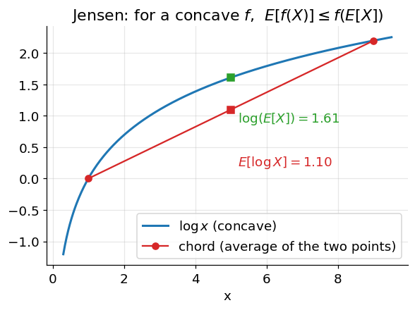

# Convexity and Jensen's Inequality

**Before Lecture 14.** The lecture builds a lower bound on a hard-to-optimize
quantity using one inequality about averages and curved functions. This note is
that inequality.

Prerequisite: expectation ([00_before_course_begins.md](00_before_course_begins.md), §3.2).

---

## 1. Convex and concave functions

- **Convex** ("holds water"): the chord joining any two points on the graph lies
  **on or above** the curve. Second derivative $f'' \ge 0$.
  Examples: $x^2$, $e^x$, $|x|$.
- **Concave** ("spills water"): the chord lies **on or below** the curve.
  $f'' \le 0$. Examples: $\ln x$, $\sqrt{x}$.

A function is concave exactly when its negative is convex.

---

## 2. Jensen's inequality

For a **concave** function $f$ and any random variable $X$,

$$
E[f(X)] \;\le\; f\big(E[X]\big)
$$

For a **convex** function the inequality flips: $E[f(X)] \ge f(E[X])$.

In words: **applying a concave function then averaging gives less than averaging
then applying the function.** Equality holds only if $X$ is constant or $f$ is
linear.

### Why it is true (two-point picture)

Take $X$ equal to $x_1$ or $x_2$, each with probability $\tfrac12$. Then
$E[X] = \tfrac{x_1 + x_2}{2}$ is the midpoint, and
$E[f(X)] = \tfrac{f(x_1) + f(x_2)}{2}$ is the midpoint of the **chord**. For a
concave $f$ the chord sits below the curve, so the chord's midpoint
$E[f(X)]$ is below the curve's value $f(E[X])$.

### Worked example

$X$ takes the value $1$ or $9$, each with probability $\tfrac12$; $f = \ln$
(concave).

$$
E[X] = \tfrac12(1) + \tfrac12(9) = 5
\qquad\Rightarrow\qquad
f(E[X]) = \ln 5 = 1.609
$$

$$
E[f(X)] = \tfrac12\ln 1 + \tfrac12\ln 9 = \tfrac12(0) + \tfrac12(2.197) = 1.099
$$

Indeed $1.099 \le 1.609$. The gap ($0.51$) is exactly the "gap between the chord
and the curve" and shrinks as the two points move closer together.

### A convex check

Same $X$, but $f(x) = x^2$ (convex):

$$
f(E[X]) = 5^2 = 25,
\qquad
E[f(X)] = \tfrac12(1) + \tfrac12(81) = 41
$$

Now $E[f(X)] = 41 \ge 25 = f(E[X])$ — the inequality points the other way, as
promised.

---

## 3. The useful consequence

Jensen lets you move a concave function **outside** an expectation to get a bound
you can work with:

$$
\ln E[Z] \;\ge\; E[\ln Z]
$$

Whenever a log of an average (or a log of a sum) is awkward to handle directly,
replacing it with the average of the logs gives a tractable **lower bound**, and
maximizing that bound is a proxy for maximizing the original. That substitution is
the mechanical core of what Lecture 14 does.

---

## Check yourself

1. Is $f(x) = -3x + 2$ convex, concave, both, or neither?
2. $X$ is $2$ or $8$ with equal probability. For $f = \sqrt{\cdot}$, compute
   $E[f(X)]$ and $f(E[X])$ and confirm the direction of Jensen.
3. For which functions does Jensen hold with **equality** regardless of $X$?
4. $X$ is $4$ or $16$ with equal probability. Use Jensen (concave $\ln$) to say
   which is larger, $\ln 10$ or $\tfrac12(\ln 4 + \ln 16)$, without a calculator.
5. If $f$ is convex, write Jensen's inequality for $f$.

Answers

1. Both — a linear function is convex *and* concave ($f'' = 0$), and Jensen holds
   with equality.
2. $E[X] = 5$, $f(E[X]) = \sqrt5 = 2.236$;
   $E[f(X)] = \tfrac12(\sqrt2 + \sqrt8) = \tfrac12(1.414 + 2.828) = 2.121$.
   $2.121 \le 2.236$ — concave, so $E[f(X)] \le f(E[X])$. ✓
3. Linear functions ($f(x) = ax + b$), or any $X$ that is actually constant.
4. $\ln$ is concave so $E[\ln X] \le \ln E[X]$, i.e.
   $\tfrac12(\ln 4 + \ln 16) \le \ln 10$. So $\ln 10$ is larger.
5. $E[f(X)] \ge f(E[X])$.

