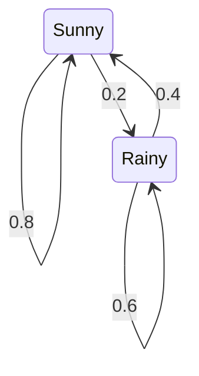
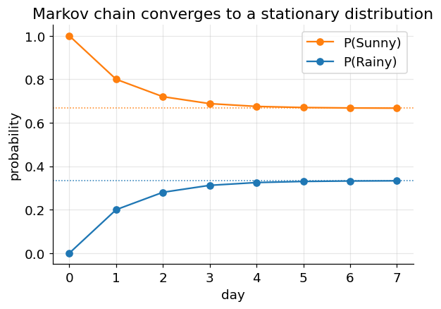

# Markov Chains and Transition Matrices

**Before Lecture 17.** The lecture models a system that moves between states over
time. This note covers the underlying object: a Markov chain and its transition
matrix, and how you propagate a probability distribution forward.

Prerequisite: conditional probability and matrix–vector multiplication
([00_before_course_begins.md](00_before_course_begins.md), §1.4 and §3.4).

---

## 1. The Markov property

A **Markov chain** is a sequence of random states $S_0, S_1, S_2, \dots$ in which
the next state depends **only on the current state**, not on the full history:

$$
P(S_{t+1} \mid S_t, S_{t-1}, \dots, S_0) = P(S_{t+1} \mid S_t)
$$

"The future is independent of the past, given the present."

---

## 2. The transition matrix

Collect the one-step probabilities into a matrix $P$, where $P_{ij}$ is the
probability of moving **from state $i$ to state $j$**:

$$
P_{ij} = P(S_{t+1} = j \mid S_t = i)
$$

Every row is a probability distribution, so **each row sums to 1** (such a matrix
is called *row-stochastic*).

### Example — a two-state weather chain

States: Sunny, Rainy. Rows are "from", columns are "to", in the order
(Sunny, Rainy):

$$
P = \begin{bmatrix} 0.8 & 0.2 \\ 0.4 & 0.6 \end{bmatrix}
$$

- Row 1 (from Sunny): $P(\text{Sun}\to\text{Sun}) = 0.8$,
  $P(\text{Sun}\to\text{Rain}) = 0.2$.
- Row 2 (from Rainy): $P(\text{Rain}\to\text{Sun}) = 0.4$,
  $P(\text{Rain}\to\text{Rain}) = 0.6$.
- Each row sums to 1: $0.8 + 0.2 = 1$ and $0.4 + 0.6 = 1$. ✓

---

## 3. Propagating a distribution forward

Write the current belief as a **row vector** $\pi_t = [\,P(\text{Sun})\;\;
P(\text{Rain})\,]$. One step forward is a vector–matrix product:

$$
\pi_{t+1} = \pi_t \, P
$$

Start certain it is sunny, $\pi_0 = [1, 0]$:

$$
\pi_1 = [1, 0]\begin{bmatrix} 0.8 & 0.2 \\ 0.4 & 0.6 \end{bmatrix}
= [\,1(0.8) + 0(0.4),\;\; 1(0.2) + 0(0.6)\,] = [0.8,\; 0.2]
$$

$$
\pi_2 = [0.8, 0.2]\,P
= [\,0.8(0.8) + 0.2(0.4),\;\; 0.8(0.2) + 0.2(0.6)\,]
= [\,0.64 + 0.08,\;\; 0.16 + 0.12\,] = [0.72,\; 0.28]
$$

| day $t$ | $P(\text{Sun})$ | $P(\text{Rain})$ |
|---|---|---|
| 0 | 1.000 | 0.000 |
| 1 | 0.800 | 0.200 |
| 2 | 0.720 | 0.280 |
| 3 | 0.688 | 0.312 |
| 4 | 0.675 | 0.325 |
| $\infty$ | 0.667 | 0.333 |

$n$ steps forward is just $\pi_0 P^n$.

---

## 4. The stationary distribution

The rows above settle to a fixed vector $\pi^\star$ that no longer changes under
another step:

$$
\pi^\star P = \pi^\star
$$

For this chain $\pi^\star = \left[\tfrac23,\ \tfrac13\right]$. Check the Sunny
component: $\tfrac23(0.8) + \tfrac13(0.4) = 0.533 + 0.133 = 0.667 = \tfrac23$. ✓

For a chain like this one (you can get from any state to any other, and it is not
stuck in a fixed cycle) the distribution converges to $\pi^\star$ **regardless of
where it starts**.

---

## 5. Adding rewards (a one-line preview)

Lecture 17 attaches a numeric **reward** to states and asks which choices maximize
total reward over time. The state-transition machinery above — a stochastic matrix
acting on a distribution — is the part to be comfortable with beforehand.

---

## Check yourself

1. Is $\begin{bmatrix} 0.5 & 0.5 \\ 0.3 & 0.8 \end{bmatrix}$ a valid transition
   matrix? Why or why not?
2. With the weather $P$ above and $\pi_0 = [0, 1]$ (certainly rainy), compute
   $\pi_1$ and $\pi_2$.
3. From day 2's $[0.72, 0.28]$, compute day 3 and confirm it matches the table.
4. Verify that $\pi^\star = [2/3, 1/3]$ also reproduces the Rain component after
   one step.
5. A chain has $P = \begin{bmatrix} 0 & 1 \\ 1 & 0 \end{bmatrix}$ and starts at
   $[1, 0]$. Does it converge to a stationary distribution? What does it do?

Answers

1. No — the second row sums to $1.1$, not $1$.
2. $\pi_1 = [0,1]P = [0.4, 0.6]$;
   $\pi_2 = [0.4, 0.6]P = [0.4(0.8) + 0.6(0.4),\; 0.4(0.2) + 0.6(0.6)]
   = [0.56, 0.44]$.
3. $[0.72(0.8) + 0.28(0.4),\; 0.72(0.2) + 0.28(0.6)]
   = [0.576 + 0.112,\; 0.144 + 0.168] = [0.688, 0.312]$. ✓
4. Rain: $\tfrac23(0.2) + \tfrac13(0.6) = 0.133 + 0.2 = 0.333 = \tfrac13$. ✓
5. It does not converge — it oscillates $[1,0] \to [0,1] \to [1,0] \to \dots$
   forever. (This chain is *periodic*, so the "converges from any start" rule does
   not apply. Its stationary vector $[0.5, 0.5]$ exists but is never reached from
   a pure starting state.)

